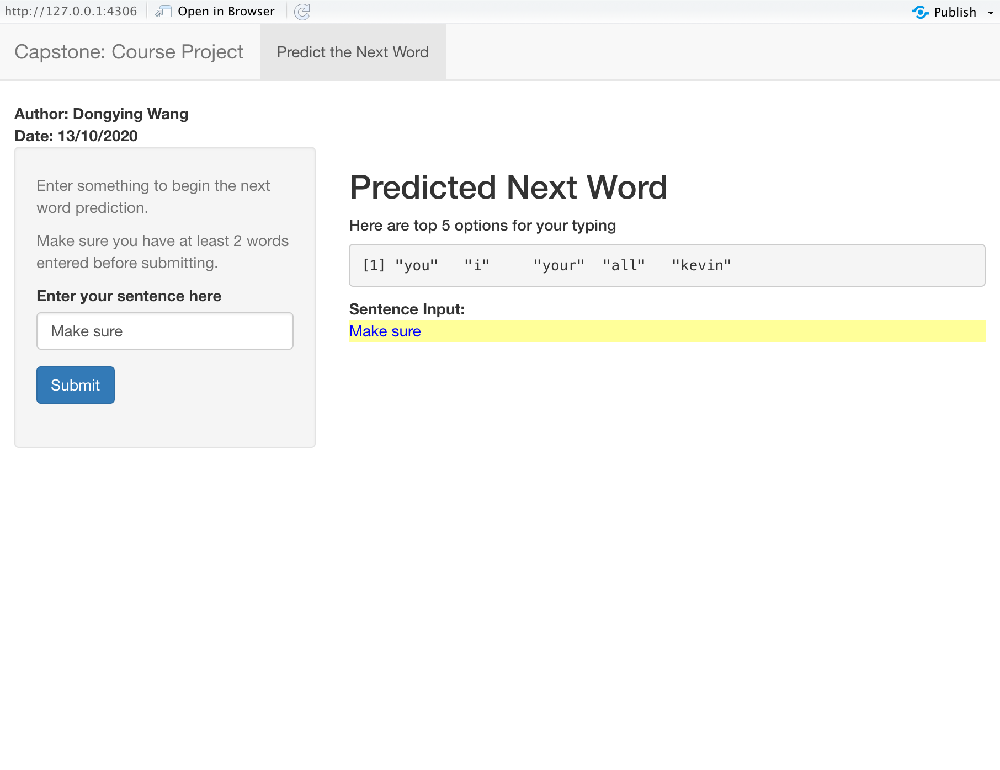

```{r setup, include=FALSE}
knitr::opts_chunk$set(echo = FALSE)
```

## Project Overview

The goal of this exercise is to create a product to highlight the prediction algorithm that you have built and to provide an interface that can be accessed by others.

The source data for this project can be found at: https://d396qusza40orc.cloudfront.net/dsscapstone/dataset/Coursera-SwiftKey.zip

My Shiny App can be found at: https://dora-dongying.shinyapps.io/NextWordPrediction/

If you would like to review my source code, it is located on GitHub at:https://github.com/Dora-dongying/DataScienceCapstone_project_MySwiftKey

## Data preparation

In order to build a prediction algorithm, data was scraped from blogs, twitter and the news.

- Data cleaning was performed: stripping out of numbers and punctuation, changing all text to lowercase and removing the whitespace.
- N-grams were created, these are a sequence of items collected from a corpus. For this project, unigrams, bigrams, trigrams were used.
- The N-grams were sorted and the metadata saved as an .rData file.

The exploratory analysis can be find at: https://rpubs.com/dora_dongying/672240.

## The Prediction Model 

The model for the next word prediction was based on the Katz Back-off algorithm.   

Katz back-off is a generative n-gram language model that estimates the conditional probability of a word given its history in the n-gram. It accomplishes this estimation by backing off through progressively shorter history models under certain conditions. By doing so, the model with the most reliable information about a given history is used to provide the better results.

The detailed process follows the model found in wikipedia: https://en.wikipedia.org/wiki/Katz%27s_back-off_model


## My Shiny Application

```{r, out.width = "800px"}

```


